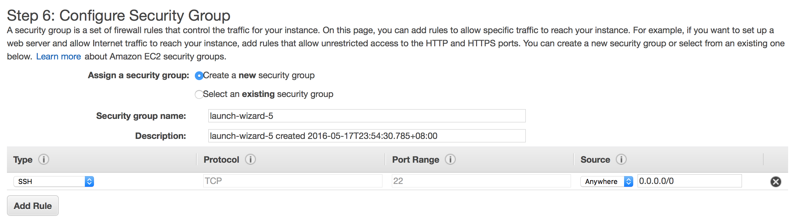

# Module 1 - EC2

### Create Key Pair

1. Pick `NETWORK & SECURITY` > `Key Pairs`

2. Create key pair, and download `.pem` file

### Create Instance

1. Open the Console.

2. Go to EC2 console, click `Lunch Instance` button.

    *You can check [this page](http://aws.amazon.com/cn/ec2/pricing/) for pricing detail*

3. Choose the Amazon Machine Image you want to use.

    *Some of the AMI are not free tier eligible, choose one you like*
    *Suggest use `Amazon Linux AMI` for learning and testing*

4. Choose an Instance Type.

    *Different Instance type have different CPU, Memory, disk... Choose one that suit your requirement*
    *For now, only `t2.micro` are free tier eligible*

5. Configure you instance.

    *Just use default value here will also works, hover on the information icon, will show further details*
    
    
    
6. Add Storage.

    *Add Storage for your instance, the root volume will be added by default, you can add your new volume*
    *The new volume which type is `ELB` will persists independently from the lifetime of an instance*
    *There are two volume type column, in the second one, you can choose SSD or HDD you want for this volume*
    
    
    
7. Add Some Tag.

    *Tag is like label for your instance, lear more about tag, by this [link](https://docs.aws.amazon.com/AWSEC2/latest/UserGuide/Using_Tags.html?icmpid=docs_ec2_console)*
    
8. Choose/Create Security Group.

    *Choose or create security group, you can define firewall rules to control traffic here*
    
    
    
    
9. Review your instance information and press lunch.

10. Choose the key pair we already created, after press lunch.

    
    
### SSH to the instance

1. Go to `INSTANCES` > `INSTANCES`

2. Find your instance, and click it, will show detail below there.

3. Find public IP there.

    
    
4. Use `.pem` file, which downloaded in first step, to login the instance.

        ssh -i {key_pair_file_name}.pem {instance_user_name}@{instance_public_id}
    *For user name of the instance, you can find default user name in this [link](https://alestic.com/2014/01/ec2-ssh-username/)*
    
5. If you successfully login, you can see this

    
